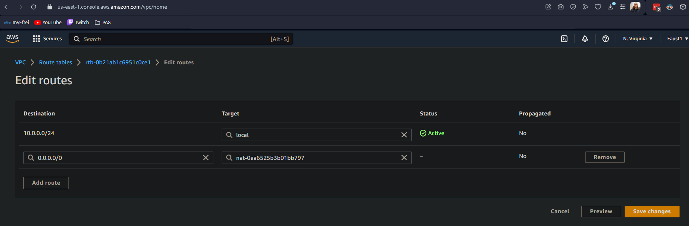

#### Here is the architecture we are trying to make in AWS

This architecture allows us to create a secure RDS mariadb dataabse inside a private subnet, so only our website in the same VPC will be able to access our database.

#### We start by creating a VPC  

#### Then we create two subnets: one public (for the ec2), one private (for the rds)

#### Then we create an internet gateway  

#### We then edit our automaticaly generated route to add our internet gateway

#### Then, we create a Cloud9 development environnement, with an t2.micro ec2 instance, and we put it inside the public subnet of our VPC  

#### We run a bunch of commands on the ec2 instance to create the httpd and mariadb service.  

#### We can now edit the inboud rules of our newly created ec2 instance.

#### Then, we can see the result on the internet.  

#### We then create a NAT gateway to manage connections.  

#### We also create a new route to target the nat gateway  

#### We modify our route subnet association to the private subnet.

#### Then, we edit the subnet association for the route table to detect the private subnet  

#### Now, let's focus on the RDS. First, we need to create a subnet group:

#### After this, we create the RDS database inside of the private subnet. We link it directly to the ec2 ressource.
  

#### Let's not forget to update inbound rules of our VPC in order to accept mysql

#### we managed to connect to our database and looked for  the databases.

#### We insert the data form the sql dump file into the database using our ec2 instance.  
  

#### We can see that the private/public relation between our ec2 istance and RDS is workling, because we can't log into our database from another computer.  

#### We can see that the code uses endpoints in order to retrieve information about the database. Let's create them using the Systems Manager

#### Then, we can observe that the data is read from our RDS database  

